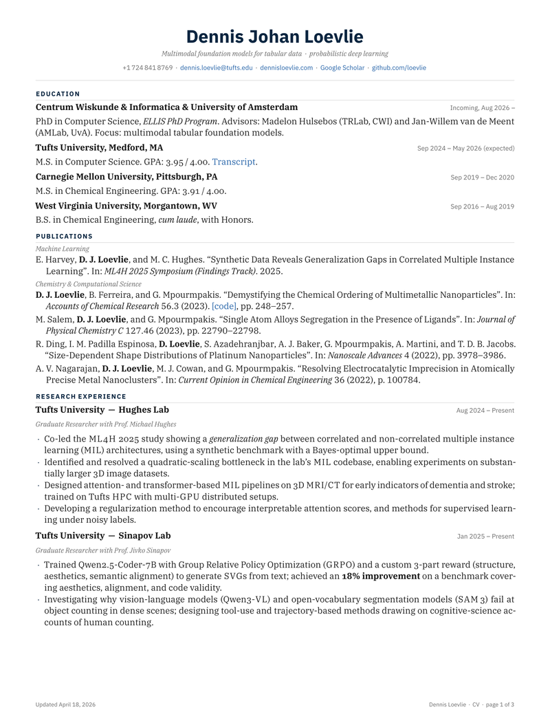

# Dennis Johan Loevlie — CV

**Live PDF:** [`loevlie-cv-latest.pdf`](https://loevlie.github.io/cv/loevlie-cv-latest.pdf) ·
**Source:** [`main.tex`](./main.tex) · **Site:** [`loevlie.github.io`](https://loevlie.github.io/) (in [`site/`](./site/))

<p align="center">
  <a href="https://loevlie.github.io/cv/loevlie-cv-latest.pdf">
    
  </a>
</p>

## Project layout

```
cv/
├── main.tex             # canonical academic CV (IBM Plex, biblatex+publist)
├── publications.bib     # one bibliography, drives both CV and site
├── industry.tex         # FAANG-style two-column variant
├── variants/            # font + layout experiments
├── sandbox/             # in-flight aesthetic experiments (don't ship)
├── letter/              # cover-letter + cold-outreach templates
├── slides/              # Touying (Typst) + Beamer fallback talk template
├── site/                # Quarto personal site + per-paper project pages
├── scripts/             # citation refresh, etc.
├── assets/              # README cover, favicon
└── .github/workflows/   # build-cv.yml + refresh-citations.yml
```

## Build

```bash
make             # build canonical CV (main.tex)
make industry    # build industry CV
make variants    # build every variant in variants/
make watch       # latexmk -pvc continuous mode
make dist        # stage main.pdf into dist/ as loevlie-cv-YYYY-MM.pdf and -latest.pdf
make lint        # chktex pass on main.tex
make clean       # remove aux/log files
```

Requires TeX Live 2024+ (or MacTeX) with `biber`, `biblatex`, `biblatex-publist`,
`hyperxmp`, `bookmark`, `xurl`, `microtype`, and the IBM Plex font packages
(`plex-serif`, `plex-sans`, `plex-mono`).

## Add a publication

1. Append a `@article{...}` or `@inproceedings{...}` entry to [`publications.bib`](./publications.bib).
2. Set `author+an = {N=highlight}` so my surname renders in **bold** (where N is my position in the author list).
3. Tag with `keywords = {ml, ...}` or `keywords = {chem, ...}` to put the entry under the right subsection.
4. `make` — biber pulls the entry in automatically.

## Stack

- **Engine**: pdflatex (with `latexmk` driving the rerun for biber + lastpage)
- **Body**: IBM Plex Serif with old-style proportional figures
- **Headers / dates**: IBM Plex Sans (lining tabular figures)
- **URLs / code**: IBM Plex Mono
- **Bibliography**: `biblatex` (`numeric` style) + `biblatex-publist` macros + `author+an` highlighting
- **PDF metadata**: `hyperxmp` (Adobe Bridge / Google Scholar / ATS pipelines)
- **Outline**: `bookmark` package for navigable Acrobat side-panel
- **URL wrapping**: `xurl` so long DOIs don't overflow

## Variants (`variants/`)

| File | Body font | Aesthetic move |
|------|-----------|----------------|
| `main_v3_stanford_margins.tex` | Plex Serif | Bringhurst-correct measure (~75 chars/line, 0.85in margins) |
| `main_v4_lualatex.tex` | Plex Serif | LuaLaTeX engine; OTF + native Unicode |
| `main_v5_1_cochineal.tex` | Cochineal | Real small caps (Caslon revival) |
| `main_v5_2_libertinus.tex` | Libertinus Serif | Real small caps (Linux Libertine fork) |
| `main_v5_3_ebgaramond.tex` | EB Garamond | Real small caps (classical Garamond) |
| `main_v6_marginnote.tex` | Plex Serif | Tufte-style — dates in left margin |
| `main_v7_michaillat.tex` | Plex Serif | Michaillat-style — section headers in left margin |

## Sandbox (`sandbox/`)

| File | Experiment |
|------|------------|
| `color_terracotta.tex` | Anthropic terracotta `#CC785C` accent |
| `color_prussian.tex` | Prussian blue `#003153` accent |
| `ellis_credibility.tex` | Triple-name-drop line under Education (Hulsebos + van de Meent + ELLIS) |
| `short_2page.tex` | `\shortversion` toggle that drops AiThElite + collapses to 2 pages |
| `sparkline_demo.tex` | Tufte sparkline taste test for citation trajectories |

## Cover letter + cold outreach (`letter/`)

- [`letter.tex`](./letter/letter.tex) — formal cover letter, same brand as the CV
- [`cold_letter.tex`](./letter/cold_letter.tex) — short outreach template with subject-line patterns and follow-up cadence guidance baked in (per the v5 outreach research)

## Slide template (`slides/`)

- [`talk.typ`](./slides/talk.typ) — primary: Touying on Typst with IBM Plex.
  Compile: `typst compile slides/talk.typ`
- [`talk_beamer.tex`](./slides/talk_beamer.tex) — fallback: Beamer + Metropolis +
  IBM Plex (for venues that demand `.tex` source)

## Personal site (`site/`)

Quarto site with per-paper project pages — intended to deploy as
`loevlie.github.io`. Sharing `publications.bib` with the CV means a single
source of truth for both the PDF and the project-page index.

```bash
cd site && quarto preview         # local dev
cd site && quarto render          # static build into site/_site
```

The CV's per-paper `[project]` links resolve to `loevlie.github.io/papers/<slug>`.

## Citation refresh

[`scripts/fetch_citations.py`](./scripts/fetch_citations.py) reads
`publications.bib`, queries Semantic Scholar's batch endpoint (with
OpenAlex fallback for misses), caches to `.cache/citations.json` with a
7-day TTL, and emits `metrics.tex` with `\citationsTotal`, `\citationsHIndex`,
`\citationsAsOf`, and per-paper `\cite<bibkey>{N}` macros.

The [`refresh-citations.yml`](./.github/workflows/refresh-citations.yml) workflow
runs this every Monday at 06:17 UTC and commits `metrics.tex` + the cache when
counts change. The build-cv workflow then rebuilds and deploys.

To enable, set repository secrets `S2_API_KEY` (request at
[semanticscholar.org/product/api](https://www.semanticscholar.org/product/api))
and `OPENALEX_API_KEY` (free at [openalex.org](https://openalex.org)).

## CI

[`.github/workflows/build-cv.yml`](./.github/workflows/build-cv.yml) builds
`main.tex` on every push, uploads PDFs as artifacts, and (on `main`) deploys
to GitHub Pages.

`https://loevlie.github.io/cv/loevlie-cv-latest.pdf`

## License

Source: MIT. CV content: All rights reserved.
